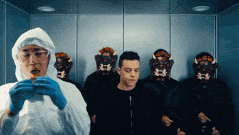

# hey, I'm Mina

close people call me **Minita**

**certified digital troublemaker** — code, design, robotics, occasional chaos

### what I'm up to these days
- breaking things, then fixing the things I broke
- building tools nobody asked for but everyone ends up using
- losing to an AI I trained myself
- collecting scholarships like Pokémon cards

### design taste
black, sharp corners hate me back

### stack-ish
**Languages:** JS/TS, Python
**Frontend:** React, Next.js, shadcn/ui
**Backend/Automation:** Google Apps Script, Supabase, N8N
**ML/AI:** PyTorch
**Tools:** Vite, Git, WSL2, clasp
**Runs on:** too much caffeine, metal music, spite

Cairo-based · probably breaking something right now

